# Star Note - 서비스 플로우차트

**버전:** 1.0  
**작성일:** 2024-12-25  
**목적:** Star Note 서비스의 주요 기능별 플로우를 시각화

---

## 목차

1. [전체 시스템 아키텍처](#전체-시스템-아키텍처)
2. [메모 작성/편집 플로우](#메모-작성편집-플로우)
3. [멘션 처리 플로우](#멘션-처리-플로우)
4. [AI 연결 제안 플로우](#ai-연결-제안-플로우)
5. [그래프 시각화 플로우](#그래프-시각화-플로우)
6. [메모 검색 플로우](#메모-검색-플로우)
7. [연결 승인/거부 플로우](#연결-승인거부-플로우)

---

## 전체 시스템 아키텍처

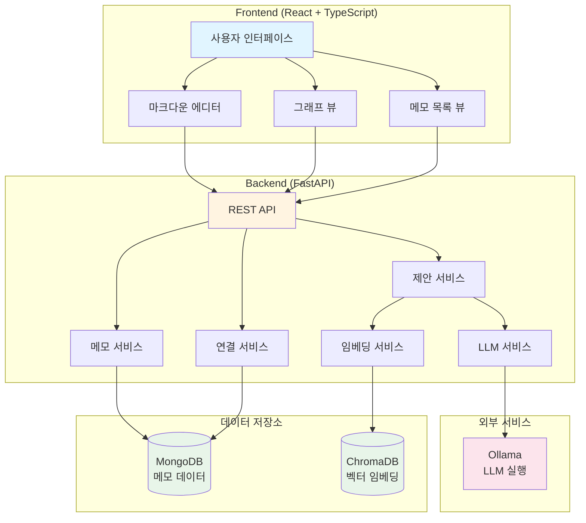

---

## 메모 작성/편집 플로우

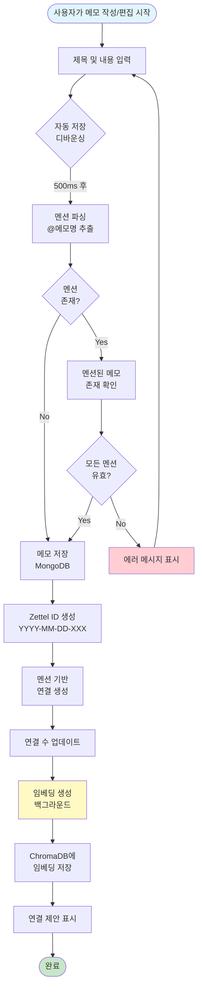

---

## 멘션 처리 플로우

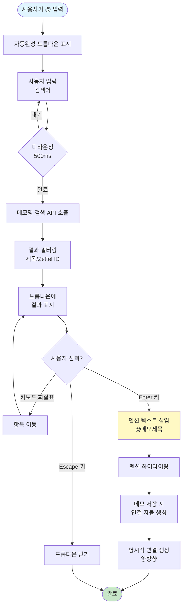

---

## AI 연결 제안 플로우

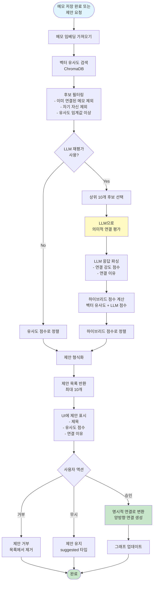

---

## 그래프 시각화 플로우

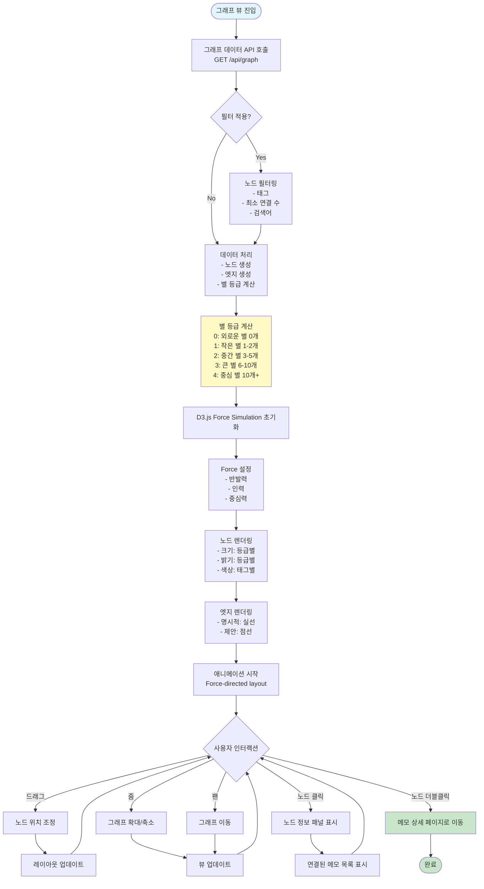

---

## 메모 검색 플로우

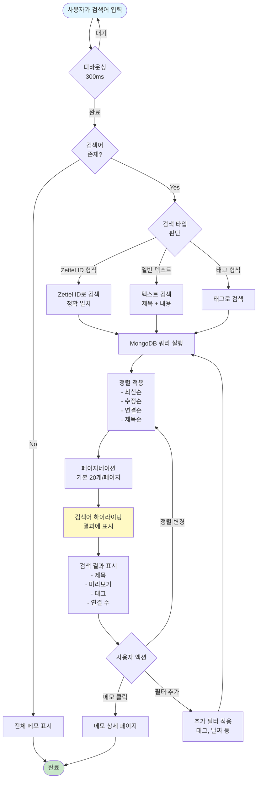

---

## 연결 승인/거부 플로우

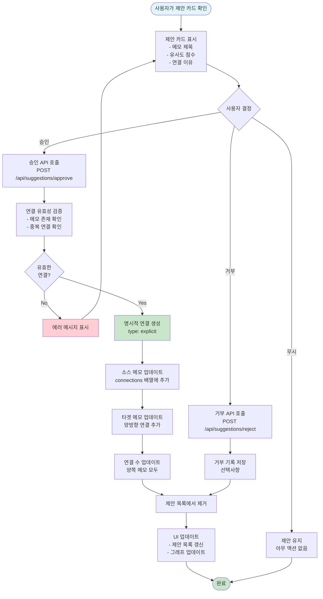

---

## 데이터 흐름 다이어그램

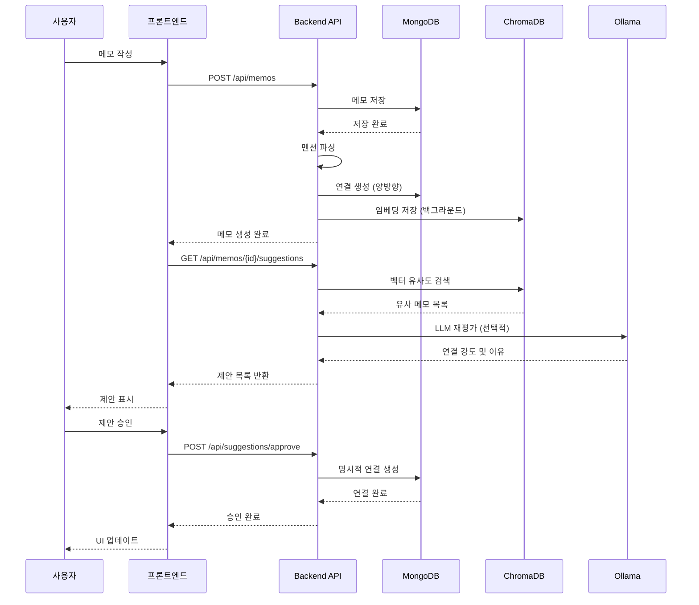

---

## 주요 상태 전이 다이어그램

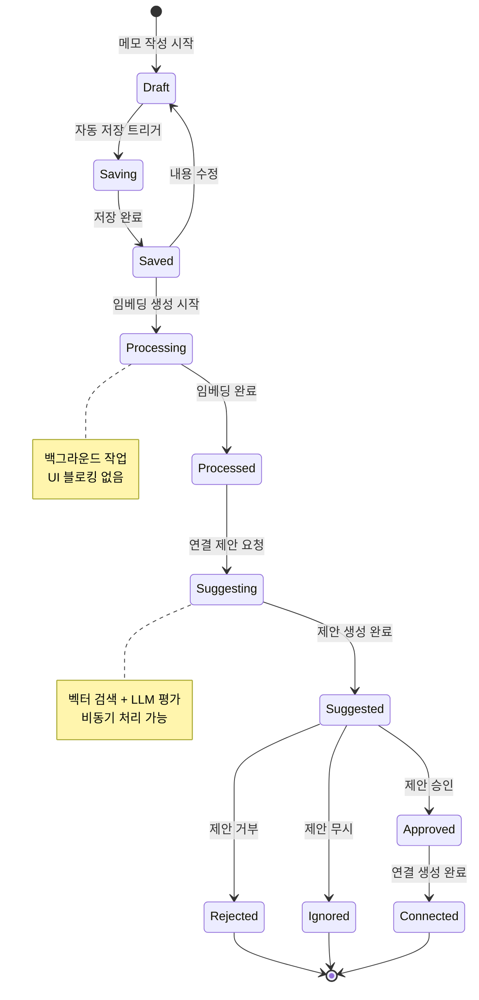

---

## 기술 스택별 책임 분리

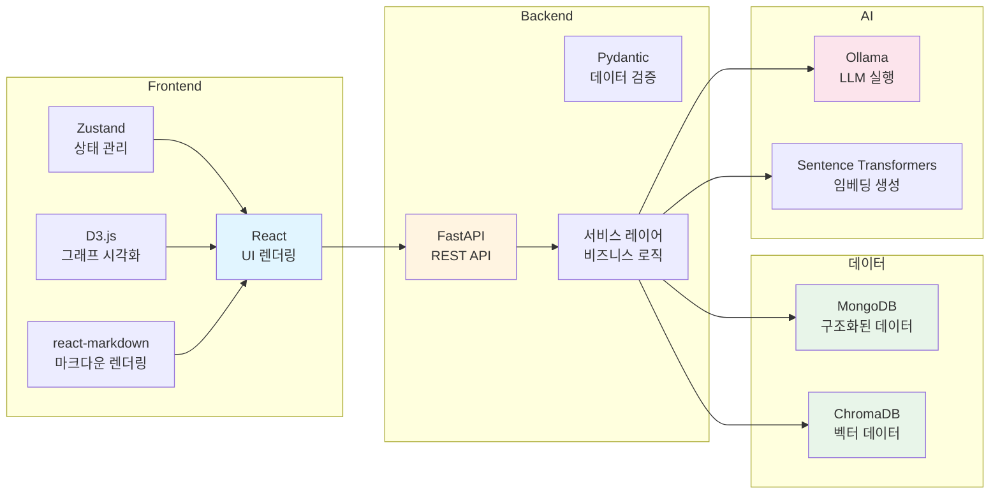

---

## 부록: 주요 API 플로우

### 메모 CRUD 플로우

```mermaid
flowchart LR
    Create[POST /api/memos<br/>메모 생성] --> Read[GET /api/memos<br/>목록 조회]
    Read --> Detail[GET /api/memos/{id}<br/>상세 조회]
    Detail --> Update[PUT /api/memos/{id}<br/>메모 수정]
    Update --> Delete[DELETE /api/memos/{id}<br/>메모 삭제]
    
    style Create fill:#c8e6c9
    style Read fill:#e1f5ff
    style Update fill:#fff9c4
    style Delete fill:#ffcdd2
```

### 연결 관리 플로우

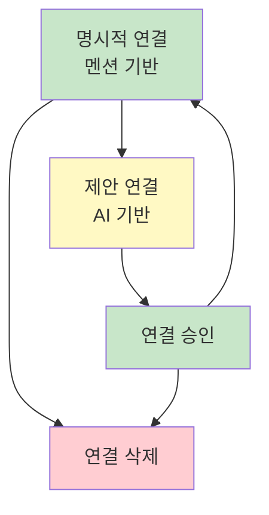

---

**문서 관리**
- 이 플로우차트는 시스템 변경 시 업데이트됩니다.
- 각 플로우는 실제 구현과 일치하도록 유지됩니다.
